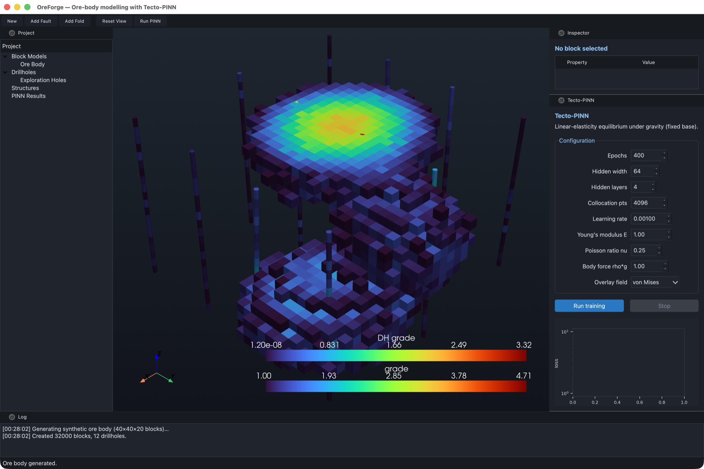
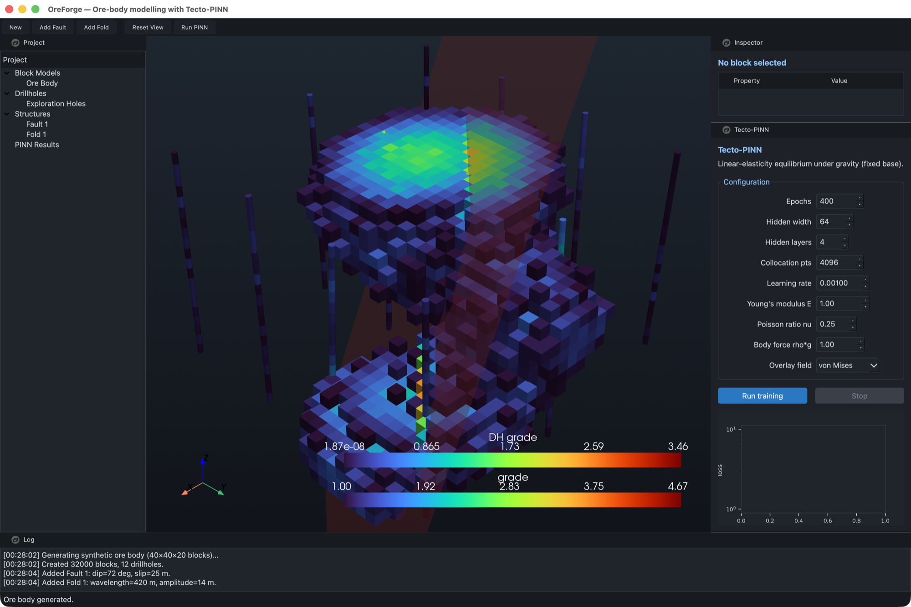
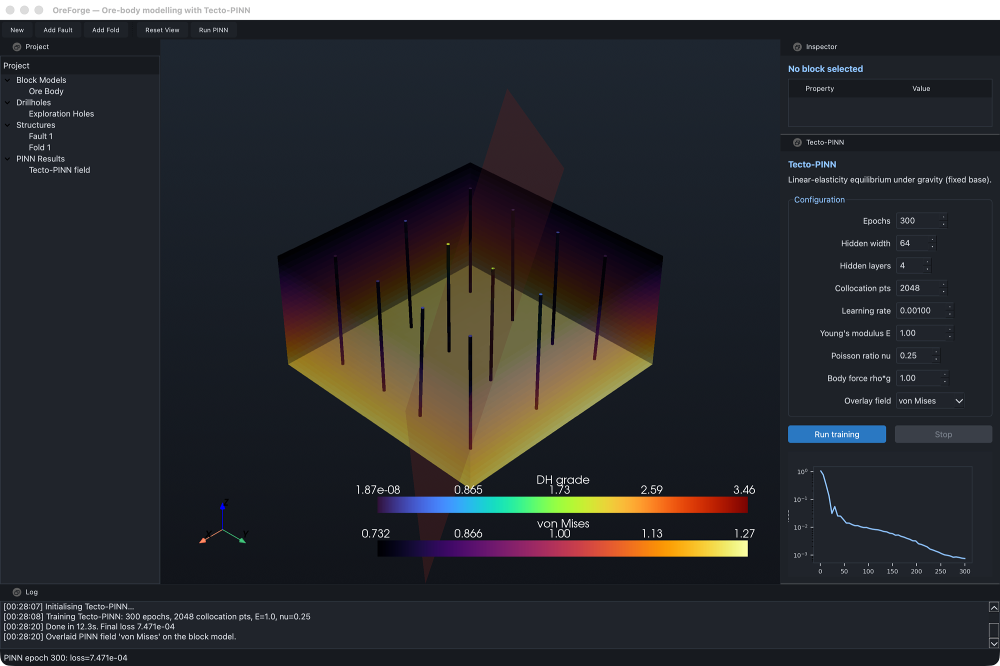

# OreForge

**Ore-body modelling with a physics-informed neural network for tectonic deformation.**

A desktop application for mineral exploration geology: build a 3D block model of an ore
body, deform it with faults and folds the way real structural geology does, and solve the
resulting elastic stress field with a physics-informed neural network — all inside one
interactive 3D workspace.



---

> ### Source code is not public
>
> OreForge is under active development, and provisional patent applications covering the
> Tecto-PINN solver are pending. The code repository is private. **The source is available
> for technical review under NDA** — contact details at the end of this page.
>
> This page documents what the system does, how it is built, and what it produces.

---

## What it does

| | |
|---|---|
| **Block modelling** | Regular 3D block model (40×40×20 = 32,000 blocks in the demo) with grade, density and rock-type attributes, grade-cutoff thresholding, and per-block inspection by clicking in the viewport. |
| **Drillholes** | Collar / orientation / assay data model with down-hole interval sampling, rendered as coloured tubes so assays and the block model can be read against each other. |
| **Structural geology** | Fault planes defined by strike, dip and slip; folds by wavelength and amplitude. Structures deform the grade field itself, so the block model shows a genuinely faulted and folded ore body rather than a decorative overlay. |
| **Tecto-PINN** | A physics-informed neural network that solves the linear-elasticity equilibrium equations under gravity with a fixed base, returning displacement and von Mises stress over the model volume. Trained live, in-app, with a streaming loss curve. |
| **Results overlay** | Any PINN field — von Mises stress, displacement magnitude, vertical displacement — is written back onto the block model and rendered in the same 3D scene as the geology. |

## Screenshots

### Ore body and drillholes

Synthetic ore body coloured by grade above a 1.0 g/t cutoff, with twelve exploration
drillholes sampling the same field.


### Faulted and folded

The same deposit after adding a fault (strike 45°, dip 72°, slip 25 m) and a fold
(wavelength 420 m, amplitude 14 m). The grade field is displaced across the fault plane —
the offset is in the geology, not painted on top of it.



### Tecto-PINN stress field

The trained network's von Mises stress field overlaid on the block model, with the live
training loss in the control dock. 300 epochs, 2,048 collocation points, final loss
7.5 × 10⁻⁴, 12 seconds on a laptop CPU.



## Architecture

```
oreforge/
├── core/           geology — no Qt, no torch
│   ├── block_model.py    regular 3D grid, attributes, PyVista export
│   ├── drillhole.py      collars, orientations, assay intervals
│   ├── geometry.py       FaultPlane (strike/dip/slip), Fold (wavelength/amplitude)
│   └── datasets.py       synthetic ore bodies and consistent drillhole sampling
├── pinn/           the solver — no UI
│   ├── tecto_pinn.py     network, PDE residual, boundary loss, stress recovery
│   └── trainer.py        QThread worker, live progress and cooperative stop
└── ui/
    ├── viewport3d.py     PyVista/VTK scene, picking, scalar overlays
    ├── main_window.py    menus, toolbar, docks, signal wiring
    └── panels/           project tree, inspector, PINN config + loss plot, log
```

Three layers, one direction of dependency: `core` knows nothing about Qt or torch, `pinn`
knows nothing about the UI, `ui` composes both. The geology can be scripted headlessly and
the solver can be swapped or benchmarked without touching the interface.

**Physics.** The network maps normalised position to a displacement vector. The loss is the
residual of the Navier–Cauchy equilibrium equations for a linear elastic solid under a body
force, evaluated by automatic differentiation at collocation points sampled through the
volume, plus a Dirichlet condition on the fixed base. Stress is recovered from the
displacement gradients and reduced to a von Mises scalar for display. Young's modulus,
Poisson ratio and body force are set in the interface and take effect on the next run.

**Threading.** Training runs on a `QThread` so the interface stays live. Two details that
cost real debugging time: torch's intra-op thread pool has to be pinned before any worker
starts, or it deadlocks when first initialised off the main thread; and the
second-derivative autograd graph overflows the 512 KB default stack of a macOS secondary
thread, so the training thread is given 128 MB.

## Stack

Python · PyTorch · PySide6 (Qt 6) · PyVista / VTK · NumPy · pandas · Matplotlib

About 1,400 lines of Python across 21 modules, with a headless logic test that stubs the
OpenGL viewport and exercises the full window wiring — project generation, structural
deformation, block picking, scalar switching and all three PINN overlay fields — without a
GPU context.

## Status

Working application, in active development. Not open source: the Tecto-PINN solver is the
subject of pending provisional patent applications. Source available for review under NDA.

## Contact

**Prof. Dr. Dmitry Mikhaylov** — Abu Dhabi, UAE

[LinkedIn](https://www.linkedin.com/in/dmitry-mikhaylov) ·
[ORCID](https://orcid.org/0009-0009-2108-6820) ·
[Substack](https://dmitrymikhaylov.substack.com)
